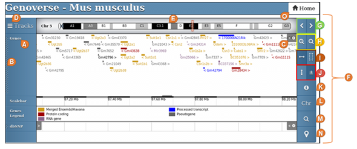
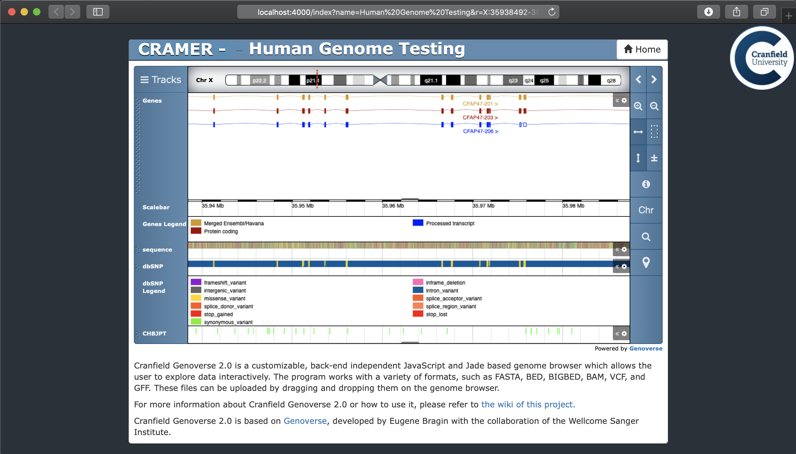
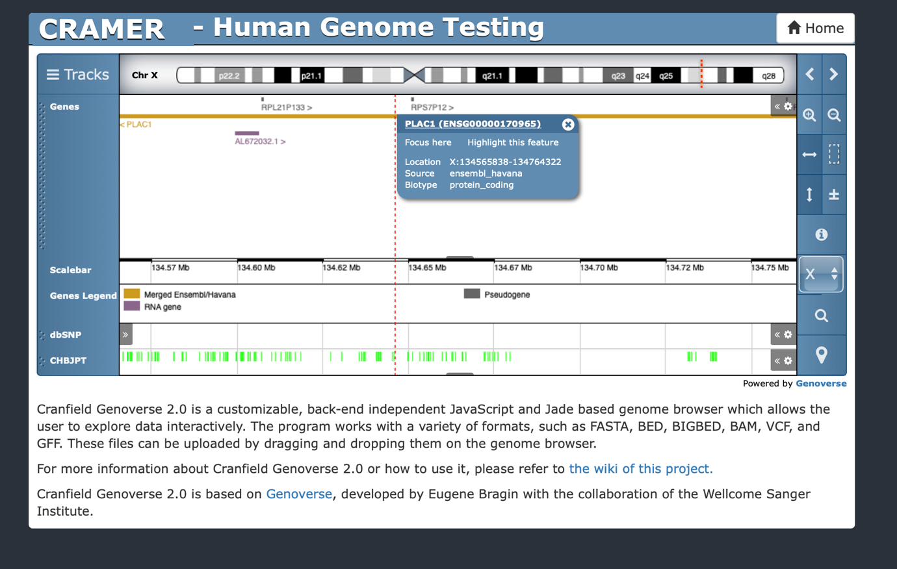

# Genoverse 2.0

## Introduction

Genoverse 2.0 is a customisable, back-end independent JavaScript and Jade based genome browser for interactive exploration of genomic data. Data is visualized in the browser, meaning Genoverse 2.0 can be installed on any website and show data from a wide range of online, ftp links or local sources. Genoverse 2.0 works with a variety of formats, such as XML, JSON, BED, VCF, GFF, GFF3, BAM or delimited text files, and can be customised to parse and display any data source as required.

The application and source code is freely available to download from the
Genoverse Github repository: <https://github.com/FadyMohareb/genoverse>.

# Table of Contents

[How to install Genoverse 2.0](#how-to-install-genoverse-20)

[Dependencies](#dependencies)

[Install on Linux](#how-to-install-genoverse-20-on-linux)

[Install on MacOS](#how-to-install-genoverse-20-on-macos)

[Genoverse 2.0 workflow](#genoverse-2.0-workflow)

[How to create a new user account](#how-to-create-a-new-user-account)

[Tracks](#tracks)

[How to navigate Genoverse 2](#how-to-navigate-genoverse-2)

[Welcome page](#welcome-page)

[Genome browser page](#genome-browser-page)

[Hands-on Example](#hands-on-example)

[Common errors](#common-errors)

[Requirements for the correct display of imported files](#requirements-for-the-correct-display-of-imported-files)

[List of Ensemble Genomes not currently available to display](#list-of-ensembl-genomes-not-currently-available-to-display)


## How to install Genoverse 2.0

This section provides detailed instructions on how to install and
execute the program, so it can to be accessed from any browser. This can be done using:
1. Pre-built Docker image download
2. Built a new Docker image using the latest version available on Git
3. Manual installation

### **Dependencies**

Genoverse 2.0 requires running on Linux or MacOS.  The programme requires NodeJS  and three commonly used bioinformatics programs.

- [NodeJS](https://nodejs.org/en/download/) LTS (The application was also tested on the latest current version 12.12.0)
- [Samtools](http://www.htslib.org/download/)
- [Bwtool](https://github.com/CRG-Barcelona/bwtool)
- [kentUtils from UCSC](https://github.com/ENCODE-DCC/kentUtils)

 Make sure that they are available on the $PATH. (Typically installed under /usr/local/bin). To check whether this is the case, type
 
 ```echo $PATH```
 
 This should include (among other paths) `usr/local/bin`

### How to install Genoverse 2.0 on Linux:

### Option 1: **Docker-based installation**
#### a. Run Genoverse using pre-built docker image
For this, you need to have Docker service available on your machine. To check if that is the case, you can run:

```sudo service docker start``` 

Verify Docker:

```sudo docker run hello-world```

 This docker image assumes there is a MongoDB service running on localhost:27017

1. Make sure monogo is up and running on Docker: 

```sudo docker run --name mongo -p 27017:27017 -d mongo:latest```

Alternatively, if you have already created the *mongo* container, run:

```sudo docker start mongo``` 

2. Run genoverse via the docker image:

```sudo docker run --rm --name=genoverse2 --pid=host --network=host digimeow/genoverse2```

You may now visit [http://localhost:4000](http://localhost:4000) in your web browser. 

#### b. Build a new docker image based on the latest git version
The easiest way to satisfy all dependencies and run Genoverse 2.0 is to build and run the Docker image defined in Dockerfile within this repository. For this, you need to have Docker service available on your machine. To check if that is the case, you can run:

```sudo service docker start``` 

Verify Docker:

```sudo docker run hello-world```

 This docker image assumes there is a MongoDB service running on localhost:27017

1. Make sure monogo is up and running on Docker: 

```sudo docker run --name mongo -p 27017:27017 -d mongo:latest```

Alternatively, if you have already created the *mongo* container, run:

```sudo docker start mongo``` 

2. Clone this repository locally: 

```git clone https://github.com/FadyMohareb/genoverse.git && cd genoverse```

3. Build the application:

```sudo docker build . -t genoverse```

4. Run Genoverse:

```sudo docker run --rm --pid=host --network=host genoverse```

You may now visit [http://localhost:4000](http://localhost:4000) in your web browser. 

**In order to start adding instances to your running application, you need to add a new admin user to the application back-end as follows:

1. Stop the application using Ctrl+C in the terminal window running the genoverse image.

2. Install the npm dependencies by running:

`npm install`

3. Add a new admin user using the following command:

`npm run newUser <user@example.com> <password> <John>`

For example: ```npm run newUser admin@admin.com adminadmin admin```

4. Build the application:

```sudo docker build . -t genoverse```

5. Run Genoverse:

```sudo docker run --rm --pid=host --network=host genoverse```


##### Docker-based installation (MacOS)
Although it is possible to get the docker image to work on Mac, the process can be tricky and not very stable. This is mainly due to the fact that the host networking driver currently only works on Linux hosts (See more information here: https://docs.docker.com/network/network-tutorial-host/). It's possible to use a different port for the application, however access to the "helper" tools such as tabix and samtools can be tricky. Therefore, we do recommend the manual installation on Mac, and this is quite straight forward as shown below:


### Option 2: **Manual installation** 
First of all, make sure you have all the [Dependencies](#dependencies) installed.  Make sure that they are available on the $PATH. (Typically installed under /usr/local/bin). To check whether this is the case, type
 
 ```echo $PATH```
 
 This should include (among other paths) `usr/local/bin`.

1. Clone the Github repository with the following command:

`git clone https://github.com/FadyMohareb/genoverse`

2. To install, run the following commands:

`cd \<Genoverse/Directory\>`

`npm install`

`node bin/www`

3. The output should be:

`Running at port: \<port\>`

`MongoDB connection open`

4. Then, it could be accessible from any browser on any operating
   systems. Open your browser and write this in the URL address. Make
   sure the port value is the same than in the output displayed in the
   prompt command:

`localhost:\<port\>`

OR

`IPaddress:\<port\>`

To begin adding visualisation instances, you need to add a new admin user using the following command:

`npm run newUser <user@example.com> <password> <John>`

For example: ```npm run newUser admin@admin.com adminadmin admin```


Once installed, the multiple files that form the program can be altered
to change the functionalities of the program as the developer team
wants, and then saved to apply these changes. However, modified files
which are contained in *list-js.js* would require building the program
before running it to apply the changes. This can be done with the
following command:

`$ npm run-script build`

## Genoverse 2.0 workflow

Genoverse 2.0 consists of multiple web pages backed by a node server, and
a mongo database. It provides a number of web pages to assist with
setting up and visualising genomic tracks (**Fig. 1**), with the actual
genome browser page as the main gateway for the program. It is made up
of a set of tracks – horizontal sections of the browser which display
features, such as genes or variants, – which share the same start and
end position. These features can either be fetched from Ensembl or
extracted from a local or FTP file. Currently, the browser
supports the following types of data files: FASTA, BED, BIGBED, BAM,
WIG, BIGWIG, GFF, GFF3, GTF, VCF and RSEM genes.results. In addition,
Genoverse has a series of plugins which add extra functionalities.

The plugins and tracks can be configured on the instance webpage. An
instance is a combination of a chosen genome, a choice of the plugins to
implement, and a selection of the tracks to visualize; that will be
displayed in the browser. The genome data could be obtained from a local
file or through Ensembl database.


*Fig.1. Diagram of the relation between the multiple webpages that form*
*Genoverse 2.0.*


The welcome webpage allows registered users to create new instances or
view and modify already existing instances. Non-registered users are
still able to view and explore existing instances however they do not
have the right to create or modify instances. Our intention is not to
provide the system users with means to register and add their own
instances; instead, this functionality is reserved to the genome browser
administrator (or group of administrators) to manage, on behalf of the
research group. The reasoning behind this is to control the size of the
database and storage space on the deployment server, by preventing the
users uploading duplicating genome files and/or large bam files which
may result in running out of disk space quite quickly with genomic data.
Since all the webpages are connected to an external server and a
database, the data that is introduced from any device is stored in the
database and is readily accessible from any other device.

## File requisites

The numerous file types that the genome browser can support must adhere
to certain formatting rules. Any of the changes that are required to
convert the files into compatible files are to be carried out by the
user prior to loading them into the web application. The requirements
for compatibility for each file type are the following:

  - **GFF, VCF, and BED:** These files must be gzipped and indexed using
    tabix with the index file in the same directory \[1\]. The program
    will be able to automatically distinguish the characteristic
    chromosome IDs from the full chromosome names of the file, as long
    as the IDs are at the end of the name (for example SL2.50ch**01**).

  - **FASTA:** These files must be indexed using faidx with the index
    file in the same directory \[2\], and the chromosome names have to
    be formatted as chr\[num\] (for example chr**1**).

  - **RSEM genes.results:** Matching gene IDs should be included in the
    GFF file that is loaded with this file format as the genomic
    coordinates of the genes will be fetched from it.

  - **Genomic BAM:** These files must be gzipped and indexed with
    SAMtools with the index file in the same directory \[2\]. Like with
    tabix indexed files, the program will be able to automatically
    distinguish the characteristic chromosome IDs from the full
    chromosome names of the file, as long as the IDs are at the end of
    the name (for example SL2.50ch**01**). This can be pre-processed
    using the "processingBAM.sh" script.

  - **read coverage BIGWIG:** These files can be made compatible with
    Genoverse 2 by using the "processingBAM.sh" script that is included
    with the program. This script automates the steps to configure the
    BAM file and generate a BIGWIG file for FTP loading, which can be
    loaded into the program.
    
    The script can be executed by typing `./processingBAM.sh input.bam` in
    a Linux terminal, and following the instructions that will be
    prompted on the screen.
    
    Beware that for using the script and loading the file via FTP
    correctly the chromosome IDs must be at the end of the chromosome
    name (for example SL2.50ch01) as indicated for previous files. The
    script requires the following tools to be fully executed: samtools,
    bam2wig, and ucsc-wigtobigwig (installed through `bioconda`) \[3\].
    Any BIGWIG that follows this format can be used.

In addition to this, local files can be dragged and dropped in the
genome browser window. The drag-and-drop action is available for the
following types of files, with the prerequisite that their indexed file
is also stored in the same location: **GFF, GFF3, GTF, VCF, BED, BIGBED,
WIG, BIGWIG** and **BAM** files can all be dragged and dropped into the
user interface but their format is restricted to chromosome numbers
formatted as chr\[num\] or \[num\] (for example chr**01** or **1**).


## How to create a new user account

The administrator can create new user accounts  via the command line by typing the following:

`npm run newUser <user@example.com> <password> <John>`

The required inputs are the user's email address, the password and a user name. 

## Sign in

Registered users can sign in by clicking on the sign in link on the home page and entering their login credentials on the login page (**Fig. 2**).


*Fig.2. Login page for registered users.*

## Tracks

Currently, Genoverse 2.0 has sixteen different tracks available that can
be divided into three groups: **Standard** tracks, **Ensembl** tracks,
and **File** tracks.

There are two **Standard** tracks which can work without the need to
fetch data from Ensembl or upload a file:

  - <span class="underline">Scalebar:</span> Displays a bar which
    provides information regarding the current position in the
    chromosome.

  - <span class="underline">Chromosome:</span> Displays the karyotype of
    the selected chromosome.

The **Ensembl** tracks are only available when the user chooses a genome
from the Ensembl database. There are three Ensembl tracks:

  - <span class="underline">Ensembl Genes:</span> Fetches data from
    Ensembl and displays the genes that are present in the chosen
    chromosome positions. It also displays a legend for each gene.

  - <span class="underline">Ensembl Sequence:</span> Fetches data from
    Ensembl and displays the nucleotide sequence of the chromosome. Each
    base has a different colour assigned. Adenine (A) is green, Thymine
    (T) is red, Cytosine (C) is blue, and Guanine (G) is yellow.

  - <span class="underline">SNP Database:</span> Fetches data from
    Ensembl and displays the single nucleotide polymorphisms (SNPs)
    present for the selected positions of the chromosome. It also
    displays a legend.

The **File** tracks work in a different way to the others. A user can
generate multiple tracks of each type with a name, a short description,
and an URL or file path to the file that the user wants to display on
the browser. Each track type has different configurable properties, such
as the threshold for example, due to the nature of the file. Each track
type can be individually activated, deactivated and any tracks created
can be removed. There are eight **File** tracks available:

  - <span class="underline">FASTA sequence:</span> Displays the
    chromosome sequence from a FASTA file.

  - <span class="underline">BED Annotation:</span> Displays the
    positions and details of annotation from a BED file.

  - <span class="underline">Genomic BAM Transcripts:</span> Displays the
    sequences of reads from a genomic BAM.

  - <span class="underline">BIGWIG Graph:</span> Displays the contents
    of a BIGWIG file as a graph.

  - <span class="underline">GFF Genes:</span> Displays a GFF file with
    all the components forming a gene with exons and introns
    represented.

  - <span class="underline">VCF Variants:</span> Displays the position
    of each variation and whether they are higher or lower than the
    quality threshold set. Requires a VCF file.

  - <span class="underline">SNP Density Graphs:</span> Displays the
    density of SNPs over a range of positions. Requires a VCF file.

  - <span class="underline">Gene Expression Graphs:</span> Displays the
    predicted counts at the position of each gene.

Finally, there is an additional track available within the **File**
tracks, called **Custom** track. A **Custom** track must be written as a
JavaScript object, which will be implemented into the program. There is
no limit to the number of **Custom** tracks a user can create.

### Plugins

Table 1. provides a summary and short description of the plugins
available in Genoverse 2.

**Table 1. Plugins included in Genoverse 2.**

<table>
<thead>
<tr class="header">
<th><strong>Plugin</strong></th>
<th><strong>Implements:</strong></th>
</tr>
</thead>
<tbody>
<tr class="odd">
<td>Karyotype</td>
<td><ul>
<li><p>An ideogram of the selected chromosome on the top of the browser.</p></li>
<li><p>A marker on the ideogram that reports the current position in the chromosome. This marker can be dragged and resized, which will update the positions of the tracks to match the positions of the markers.</p></li>
</ul></td>
</tr>
<tr class="even">
<td>Track Controls</td>
<td><ul>
<li><p>An additional menu in each track which provides the option to display info about the track, or to delete it.</p></li>
</ul></td>
</tr>
<tr class="odd">
<td>Resizer</td>
<td><ul>
<li><p>A handler at the bottom of each track that can be vertically dragged to resize the track.</p></li>
</ul></td>
</tr>
<tr class="even">
<td>Focus Region</td>
<td><ul>
<li><p>A button on the control panel that resets the start and end positions currently displayed to the default ones of the instance.</p></li>
</ul></td>
</tr>
<tr class="odd">
<td>Tooltips</td>
<td><ul>
<li><p>A button that displays a brief description of each element in the genome browser.</p></li>
</ul></td>
</tr>
<tr class="even">
<td>Select Chromosome</td>
<td><ul>
<li><p>A button that displays a list of all the chromosomes for the visualised genome. A chromosome can be displayed by clicking on the chromosome number on the list.</p></li>
</ul></td>
</tr>
<tr class="odd">
<td>Search</td>
<td><ul>
<li><p>A button that displays a pop-up window which provides the option to search by gene name, gene position, gene name AND position, or ENSEMBL id in the currently displayed chromosome.</p></li>
</ul></td>
</tr>
<tr class="even">
<td>File Drop</td>
<td><ul>
<li><p>Allows users to drag and drop a file -in a format supported by Genoverse 2- directly into the browser and display it.</p></li>
</ul></td>
</tr>
</tbody>
</table>

# How to navigate Genoverse 2.0

## Welcome page


*Fig.3. Welcome page of the program for a logged-in user.*

The welcome page is where users can access existing instances.
Registered users can also log-in which provides them with the option to
create, modify or remove instances (**Fig. 3**).

On the top of the page, there is a brief welcome message and description
of what the user can do (**A**). Next to it, on the right side,
depending on whether the user is registered or not there can be
different buttons (**B**):

  - <span class="underline">Sign in:</span> Registered users can sign in
    to unlock additional actions; this will direct them to the login
    webpage.

  - <span class="underline">Create a new instance and Sign out:</span>
    Logged-in users can create new instances, which will redirect them
    to the instances webpage, or sign out of their accounts.

A list of all the available instances is displayed in the centre of the
welcome (**C**). The names of the instances are highlighted in blue
(**D**), followed by a brief description of each instance in black
(**E**). The name of the instances (**D**) are also links to the
instance deployment on the genome browser itself. If the user is
logged-in there will be two additional buttons:

  - <span class="underline">Modify:</span> A registered user can modify
    instances that are already created (**F**). This button will
    redirect the user to the instances webpage.

  - <span class="underline">Remove:</span> A registered user can delete
    an instance that is already created (**G**). Clicking on the button
    will make a pop-out window asking confirmation appear, if the user
    clicks on “OK”, the instance will be deleted.

  - 
**Instance page**


*Fig.4. (A) Instance page with examples of how to fill each field. (B)*
*Pop-up window to create a new sub-track in the GFF Gene parent track*.

The instance page is accessed through the “Create new instance” or
“Modify” button on the welcome page (**Fig. 4A**). This page is only
available for registered users and allows creating or modifying an
instance. When a new instance is being created, all the fields will be
empty. In contrast, if an instance is being modified all the previous
configurations will be provided in each field.

In the fields marked “Project Name” (A) and “Description” (B) the user
can insert the instance name and a short description which will be
displayed in the welcome page. Other fields required to be filled
include: “Genome” (**C**), for the species genome, “Chromosome” (**D**)
for the chromosome number in which the instance will be initialized
(**D**), “Start” (E) and “End” (F) which need to be filled with the
start and end positions of the chromosome to be displayed. The species
genome karyotype (**C**) can be fetched from the Ensembl database,
uploaded from a local file or selected from a list of already available
genomes. These options can be switched by a button next to the genomes
(**G**), which is formed by three sub-buttons, one per each option. The
uploaded file needs to follow the format described in the
[Appendix](#hands-on-example).

On the right top corner of the screen, there is also a “Home” button
(**H**) which redirects the user to the welcome page.

Other features of the instance page include a list with the available
plugins for the current instance (**I**), and a checkbox to
activate/deactivate individual plugins (**K, L**).

In the case where an Ensembl species genome has been selected, an
additional panel will appear underneath the “Plugins” entitled “Ensembl
tracks” (**M**). The functionality of this type of tracks has been
described in the Tracks section above.

The other two types of tracks **Standard** and **File,** are grouped
together in the “‘Tracks” box (**N**) adjacent to the “Plugins” box. The
file tracks are highlighted in blue (**O**) and next to them there is a
blue plus-shape button (**P**). Clicking on this button will display a
pop-up window which allows creating a track by filling all the required
forms (**Fig. 4B**). Once a track is created, clicking on the track type
(**O**) will reveal all the tracks of this type (**Q**). A track can be
deleted by clicking on the remove button (**R**). In the case where the
user wishes to display data from a local file on a track, a track with
an FTP file link needs to be created. It is the responsibility of the
user to write the FTP link to the correctly formatted file in order to
get a correct track display. In addition, a custom track can be created
by selecting the “Custom Track” option at the bottom of this list
(**S**).

Finally, an instance can be saved in the database by clicking on the
“Submit” button (**T**). If any parameters are incomplete or wrongly
filled, a red alert will inform the user about the cause of the error.

## Genome browser page



*Fig.5. Genome browser page. In the browse is displayed the karyotype*
*of the chromosome 5 of Mus musculus and the genes found in Ensembl for*
*the current view position.*

The genome browser page (**Fig. 5**) is where all the data of the
instances is visually represented. The interface consists of a set of
tracks, each representing a different type of data. On the left side of
the browser window there is a vertical panel with labels for each track
(**A**) and a small handler which allows the user to vertically drag the
track and relocate it (**B**). On the right side of the browser window,
there is a small menu tab (**C**) which allows the user to get more info
about the current track, adjust the height or remove the track
altogether.

On the top corner of the left panel, there is a “Tracks” button (**D**)
which displays a pop-out window where all the current implemented tracks
are listed. From there, any implemented track can be removed (clicking
on the “x” shape button) or added (clicking on the “+” shape button),
even if it has already been added.

The karyotype of the chromosome is displayed on a ribbon located at the
top of the browser window (**E**). Users can navigate through the
chromosome by clicking and dragging on the red bookmark located on the
karyotype. On the right side of the browser window there is a vertical
panel with an arrangement of multiple buttons (**F**):

  - <span class="underline">Scrolling buttons (**G**):</span> Changes
    the current view position of the chromosome to the left (\<) or
    right (\>).

  - <span class="underline">Zoom in/out buttons (**H**):</span> Changes
    the view position to get more or less detail of the viewed area.

  - <span class="underline">Mouse drag action (**I**):</span> Switches
    the outcome of the user dragging with the mouse. By default, when
    the user drags the mouse, the view position is scrolled through the
    chromosome. However, if the other option is activated, the drag
    mouse action will highlight the dragged area and zoom in.

  - <span class="underline">Mouse wheel action (**J**):</span> Switches
    the outcome of the user spinning the mouse wheel. By default, this
    will make the user scroll over the web page, but with the other
    option, the user will make zoom in/out on the area where the mouse
    cursor is placed.

  - <span class="underline">Tooltips (**K**):</span> Clicking on this
    button will display little text boxes with a brief description of
    each element on the browser interface.

  - <span class="underline">Select chromosome (**L**):</span> This
    button will display a list of all the available chromosomes.
    Clicking on one of them will show it on the browser. By default, the
    button name is “Chr” but, once that is used, it will change to the
    name of the selected chromosome.

  - <span class="underline">Search (**M**):</span> This button will
    trigger a pop-out window which allows searching genes by position,
    name, or ID. If the positions forms are not filled, the tool will
    search in the whole chromosome, while if a range of positions is
    specified, it will only look for the genes in that range. Through
    the three tick boxes, the search can be broadened to the GFF genes
    track (if it is loaded) or to Ensembl IDs and gene names, in case
    that the genome file is being fetched from Ensembl. Once the search
    is completed, a new pop-up window with all the matches will appear
    and, by doing click on one of the matches, the viewpoint will be
    moved to the position of that match.

  - <span class="underline">Reset focus (**N**):</span> This button will
    reset the viewpoint to the default one of the instances.

To get back to the welcome page, users can click on the “Home” button on
the top right corner of the browser window (**O**).

It is important to note that although the browser page allows users to
drag and drop correctly formatted files directly into the browser to
visualise them, these files will not be saved in the database.

# Hands-on Example 

**Objective:** to create a visualization instance for vcf files
containing human variant calls from the International Genome Sample
Resource (IGSR) and the 1000 Genomes Project repository.

## Download vcf files from the IGSR repository

VCF files from IGSR can be downloaded from the FTP site hosted at the
EBI ftp://ftp.1000genomes.ebi.ac.uk/vol1/ftp/.) Both the VCF files and
their corresponding indexed files (.tbi) are available to download
eliminating the need to index the VCF files for use on Genoverse. To
download the following files:
“CHBJPT.low\_coverage.2010\_09.xchr.sites.vcf.gz.” and
“CHBJPT.low\_coverage.2010\_09.xchr.sites.vcf.gz.tbi” type:

`$ wget`
`ftp://ftp.1000genomes.ebi.ac.uk/vol1/ftp/pilot\_data/paper\_data\_sets/a\_map\_of\_human\_variation/low\_coverage/snps/CHBJPT.low\_coverage.2010\_09.xchr.sites.vcf.gz\*`
\_

As already mentioned in the “File requisites” section, VCF files must be
compressed and properly indexed with tabix in order to be visualised on
Genoverse 2.

N.B. In the case where a tabix file is not available, it can be
generated by running the following command on a compressed vcf file:

`$ tabix vcf\_file.vcf.gz`

The generated tabix file must be uploaded together with its
corresponding vcf file on Genoverse 2.

## 2\. Create a new instance on Genoverse 2.0 from Ensembl

Application administrator can log into Genoverse and create new
instances or modify existing ones. To create a new instance, go to the
welcome page and click the “Sign in” button. This will prompt you to add
your credentials. Type your email address and password and press “sign
in”. After signing in click on the “Create New Instance” button to open
the instance page. Fill out the fields on the form (**Fig. 6**) to set a
name and description for the new instance, select the chromosome to
display and set the default starting and end points of view when the
instance is displayed on the browser. All these details can be modified
later. To fetch the human genome from Ensembl, go to the “Genome” region
on the top of the page and hover with the mouse over the three available
tabs to see the description of what each does. Click on the first button
(*e\!*), to activate it. This option enables you to fetch genomes from
Ensembl. Then go to the scroll down menu underneath and select “Human”.

Please note that not all the species genomes on this list can be fetched from Ensembl. The reason for this is that they are are either not available in the database, or that they content is not correctly formatted. A list of Ensembl genomes not currently displayed on Genoverse 2.0 is avellable in the [Appendix](). 

Next you need to activate the “Ensembl Tracks” to display more
information about the human genome. The available Ensembl tracks are
“Ensembl Genes”, “Ensembl Sequence” and “SNP database” and their
function has been described in the [Tracks](#tracks) section. You can
either activate all the Ensembl tracks at once or select individual
tracks to be displayed.


*Fig. 6 Form for new visualization instance on Genoverse*

### Add local files

Next, we need to visualize the files we have just downloaded in the
previous step. In this example we will upload the
“CHBJPT.low\_coverage.2010\_09.xchr.sites.vcf.gz” downloaded from
IGSR. To create new VCF tracks follow the steps below:

1.  Go to the “Track” box and activate the “VCF Highlights” tab.

2.  Click on the plus button next to “VCF Highlights”.

3.  Start populating the fields in the pop-up window. The ones marked
    with an asterisk (\*) are mandatory and consist of:
    1.  Name: Name of the track that is going to be created.
    
    2.  Info: Brief description of the track that will be used as a
        hover label on the browser.
    
    3.  URL or Filepath: The url or the filepath of the VCF file.

When the fields have been completed, press “Add Track”.

You can also create a SNP density track by activating the “Add SNP
Density Track” and uploading the same VCF file.

Finally press the “Submit” button. This action will take you back to the
instance list page. Scroll down and select the name of the instance you
just created from the instance list. This will open the genome browser
window (**Fig. 7**) and will display the data for the chromosome and
specific region you selected when creating the instance. This
information is also contained within the URL link for this page, eg.
<http://localhost:4000/index?name=Human%20Genome%20Testing&r=X:35938492-35987711>
The “r=X denotes chromosome X and **35938492-35987711** is the region
currently displayed on the genome browser. The link is updated each time
the user performs an action, such as zoom in/out or change chromosome
(Please note that the vcf file we downloaded contains only variants on
Chromosome X, so if you pick a different chromosome, the visualization
instance would work fine, however, the vcf track will contain no SNPs).
You can replicate the same view of the genome by copying and pasting the
URL link in a new tab on the web browser. 

*Fig. 7 Screenshot of the Human Genome visualisation instance showing*
*tracks for: Chromosome X and **35938492-35987711***

### Drag and drop 

An alternative way of uploading files on Genoverse 2.0 is by using the
“drag and drop” functionality which permits users to display data on
the genome browser page for as long as the instance is displayed. The
drag and drop functionality is a convenient way of displaying data
without permanently adding them to the instance. Just select files with
the proper format and drag them to the browser which will automatically
generate the tracks displaying the data for that specific region. To
replicate the example above, select both the
“CHBJPT.low\_coverage.2010\_09.xchr.sites.vcf.gz” file and its tabix
indexed file “CHBJPT.low\_coverage.2010\_09.xchr.sites.vcf.gz.tbi” and
drag and drop them in the genome browser page. The name of the new track
will be the same as the file name. In case you only selected the vcf
file, the following error message will appear: “ERROR: GZipped VCF files
must be accompanied by a .tbi index file”. Drag and drop can be used for
other file types as well.

### Explore Data

Once you have uploaded the data, there are a number of actions you can
do on the genome browser page to explore the data as described in the
“[Genome browser page](#genome-browser-page)” section.
<span class="underline">For instance, you can search for a specific gene
on a chromosome, e.g. PLAC1 on chromosome X, by first selecting the
correct chromosome from the drop down menu and then clicking on the
“Search” button and typing “PLAC1” in the name field</span> (**Fig. 8**).


*Fig. 8 Genoverse 2.0 gene search form.*

Then tick the fields “Ensembl gene IDs” and “Ensembl gene names” since
the genome is fetched from Ensembl. After clicking on the arrow next to
“Search” a list will appear containing information including the gene
name and ID and the start and end positions. By clicking on the gene
name on ID the browser will resize to display the area containing the
gene of interest. For more information on the gene you can click
anywhere on the gene schematic on the annotation track and a pop-up
window will appear with additional information (**Fig. 9**). If you
click on the gene name on the pop-up window, you will be redirected to
the Ensembl webpage for this gene, which will open in a new tab.



*Fig. 9 Genoverse gene search result for PLAC1*

## Common errors

**<span class="underline">When trying to visualise an instance the
following error messages may appear:</span>**

***“Wrong Content in the Genome File” or “Genome File Does Not Exist.”
and/or “the instance is blank”.***

This error can be caused by:

A complex chromosome name such as
“genescaffold:gadMor1:GeneScaffold\_3590:1:3911206:1 REF”

  - The chromosome positions have not been correctly established on the
    instance details.

  - An incorrect URL/Filepath

**<span class="underline">When uploading a VCF file, the following error
may appear: *“ERROR: Gzipped VCF files must be accompanied by a .tbi
index file”</span>***

This error means that the VCF file is not properly compressed.

**<span class="underline">In the genome browser page a warning may
appear after you perform the drag and drop operation: *“Data for this
track is not displayed in regions greater than 100.00 kb”.</span>***

To remove this warning press the "zoom in" button repeatedly.

# Appendix

### Requirements for the correct display of imported files

The genome file needs to be in JSON Object format. The file needs to
respect some requirements:

  - start with **‘Genoverse.Genomes.’** and then the name of the genome;

  - contain the name of the chromosome such as **“1”** or **“MT”**;

  - in the chromosome element, the **size** and the **bands** are
    **required**. The size is the length of the chromosome and the bands
    can be filled with a list to display the karyotype.

Below, there is an example of the genome file for the tomato:

*Genoverse.Genomes.tomato = {*

*"1": {*

*"size": 98543444,*

*"bands": \[\]*

*},*

*"2": {*

*"size": 55340444,*

*"bands": \[\]*

*},*

*"3": {*

*"size": 70787664,*

*"bands": \[\]*

*}*

*};*


### List of Ensemble Genomes not currently available to display (As of 20.10.2019):

##### Genome files not available

Alpaca, Algerian Mouse, Armadillo, Black snup-nosed monkey, Chinese Hamster CriGri, Chinese softshell turtle, Cod, Coelacanth, Coquerel's sifaka, Damara Mole Rat, Dolphin, Flycatcher, Hyrax, Lesser hedgehog tenrec, Marmoset, Shrew, Sloth, Sooty Mangabey, Tarsier, Tilapia, Tree Shrew, Upper Galilee, Wallaby.

##### Genome file exists with wrong content

Amazon Molly, Angola Colobus, Bolivian Squirrel Monkey, Brazilian Guinea Pig, Bush baby, C. Savignyi, Capuchin, Cave Fish, Chinese Hamster CHOK1GS, Cow, Degu, Drill, Elephant, Ferret, Fugu, Golden Hamster, Golden snub nosed monkey, Guinea Pig, Hedgehog, Horse, Kangaroo rat, Lamprey, Lesser Egyptian Jebroa, Long-tailed chinchilla, Ma's night monkey, Medaka, Megabat, Microbat, Naked mole rat female, Naked mole rat male, Northern American Deer Mouse, Panda, Pig tailed macaque, Pika, Platyfish, Squirrel, Stickleback, Tasmanian Devil, Xenopus.

# References

1\. Genome Research Limited. tabix manual page. 2018.
http://www.htslib.org/doc/tabix.html. Accessed 29 Apr 2018.

2\. Genome Research Limited. samtools manual page. 2018.
http://www.htslib.org/doc/samtools.html. Accessed 29 Apr 2018.

3\. The Bioconda Team. Using Bioconda — Bioconda documentation. 2016.
https://bioconda.github.io/. Accessed 28 Apr 2018.
